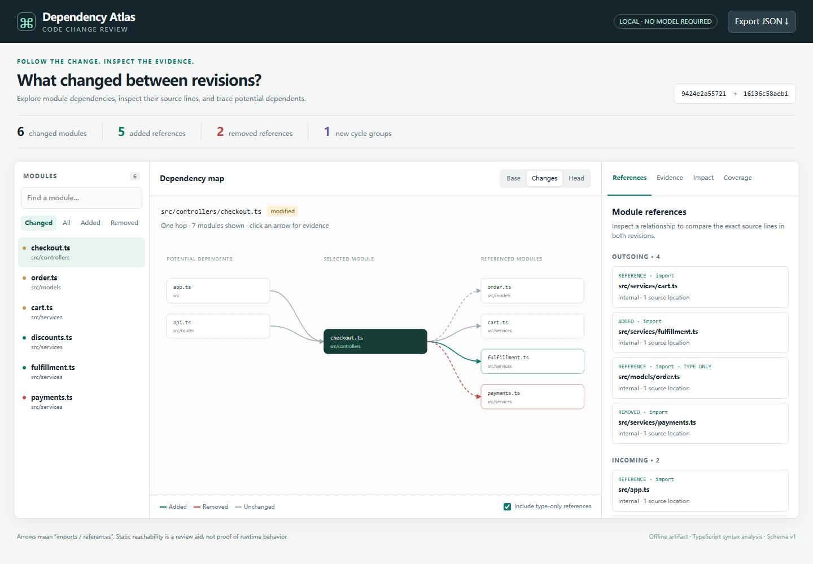

# Dependency Atlas

Review how a JavaScript or TypeScript repository's module dependencies changed
between two Git revisions. The report connects each extracted reference to its
source position, so a reviewer can inspect a changed arrow instead of trusting
an inferred architecture description.

**[Open the synthetic interactive demo](https://7364588.github.io/dependency-atlas/)**

[](https://7364588.github.io/dependency-atlas/)

The HTML report opens directly in a browser. It contains its own data, styles,
and viewer; it requires no server, account, CDN, model, or API key. Select a
module, switch between Base / Changes / Head, click an arrow to inspect both
revisions, or open Impact for paths from potential dependents.

## Install from source

Requires **Node.js 22 or 24** and Git on PATH. This repository does not assume
that a package with this name has been published to npm.

```sh
git clone https://github.com/7364588/dependency-atlas.git
cd dependency-atlas
npm ci --ignore-scripts
npm run build
node dist/cli.js --repo ../your-project --base main --head feature-branch \
  --out review.html
```

On PowerShell, place the command on one line instead of using shell line
continuations. The command writes `review.html` and `review.json`. Use
`--json another-name.json` to choose the JSON path. Run `node dist/cli.js --help`
for defaults. Exit `0` means the report was written, including any coverage
gaps; exit `2` means a usage, Git, or output error.

To create a local installable archive, run `npm pack`, then install that exact
archive with `npm install -g ./dependency-atlas-0.1.0.tgz`. The installed command
is `dependency-atlas`. No registry publication is required.

## What the report answers

- Which source modules were added, removed, or changed?
- Which syntactic dependency references were added or removed?
- Which exact statement and source position supports a reference in each revision?
- Which modules could depend on the selected module through these references?
- Did the set of modules in a cyclic group change?
- Which parts of the input were skipped, malformed, dynamic, or unresolved?

The graph shows one-hop neighbors around the selected module, with at most 18
incoming and 18 outgoing neighbors on the canvas. The reference panel retains
all extracted references. Search and module filters let you move to another
part of the repository. Type-only references are labeled and can be hidden.
The Impact panel follows reverse references up to **8 hops** and shows one
deterministic shortest path per discovered module.

## How analysis works

The CLI resolves each ref to a commit, lists its Git tree, and reads selected
blobs using Git plumbing. It never checks out a ref, reads uncommitted source
files, installs project dependencies, executes project scripts, or imports
project modules. Source syntax is parsed with the pinned TypeScript compiler
API. Configuration is read as JSONC, never evaluated as JavaScript.

Supported source extensions are `.js`, `.jsx`, `.ts`, `.tsx`, `.mjs`, `.cjs`,
`.mts`, and `.cts`, including corresponding declaration files. Analysis includes:

- Static `import` and `export ... from`, including type-only declarations.
- TypeScript `import x = require(...)`.
- Literal `require(...)` and `import(...)`, including templates without substitutions.
- Computed require/import calls, retained as `dynamic` with no invented target.
- Locally declared or parameter-shadowed `require`, retained as uncertain
  `dynamic` references rather than assumed module loading.

Each supported relative reference is resolved within the same Git snapshot.
The resolver tries source extensions and directory `index` files; common
`.js` → `.ts`/`.tsx`/`.d.ts`, `.mjs` → `.mts`/`.d.mts`, and `.cjs` →
`.cts`/`.d.cts` substitutions are supported. The root `tsconfig.json` supports
`compilerOptions.baseUrl` and exact/single-wildcard `paths` entries with ordered
target fallbacks. Alias matching prefers exact keys and longer literal prefixes.

An unmatched bare specifier is `external`; it is not proof that the package is
installed. Missing relative targets and matched-but-unresolved aliases are
`unresolved`. Symlinks are not followed. Files in `node_modules`, `dist`, `build`,
`coverage`, and `vendor` directory segments are excluded.

## Deliberate boundaries

This is a **module-reference review tool**, not a runtime call graph, test
selection oracle, vulnerability scanner, or behavioral proof. A syntactic
reference may be conditional or unused. Reverse reachability means potential
dependence. Type-only references affect type checking and are not inherently
runtime dependencies. A shadowed or computed loader can hide real dependencies.

The resolver is an explicit subset, not a replacement for TypeScript's complete
module-resolution system. It does not load package exports/imports, node_modules,
workspace package manifests, lockfiles, bundler plugins, nested tsconfigs,
tsconfig inheritance, project references, rootDirs, or moduleSuffixes. Root
`extends` and project references produce coverage notices. Cross-language files
are outside the current scope. Case matching follows Git paths, not a host
filesystem's case-insensitive behavior. Parse-error files remain visible as
modules but contribute no dependency references.

Module changes compare content hashes at the same path. A rename is an added
and removed module. Reference identities include origin, syntax kind, specifier,
type-only flag and resolution; moving a statement to another line changes its
evidence, not its identity. Duplicate identical references share an edge and
retain multiple source locations. Config changes can change reference resolution
without changing a source module's content hash.

`newCycles` compares **strongly connected component membership**, including
self-references. It reports new or expanded/changed cyclic groups. It does not
enumerate all possible loops, and adding an edge inside an existing identical
cyclic group does not create another group.

### Limits and data handling

Per revision, the Git reader allows at most 5,000 selected files, 1 MiB per file,
and 50 MiB total decoded input bytes. Its Git tree listing is bounded to 8 MiB.
Oversized source files are skipped with coverage diagnostics; an oversized tree
fails the run. Analysis records at most 20,000 reference occurrences per snapshot
and counts later occurrences in `omittedReferences`. Evidence excerpts start at
the syntax node's exact line/column and contain at most 500 characters;
`truncated` identifies shortened statements. These bounds also prevent a long
minified line from being copied in full for every reference.

The HTML/JSON **contain repository-relative filenames and source excerpts**.
Review them before sharing a report from private code. No repository absolute
path, remote URL, environment variable, or author identity is embedded by the
analyzer. Values that appear in source excerpts are not redacted. Browser labels
and evidence are rendered as text, and embedded JSON escapes HTML delimiters.
The report makes no network requests. Generated outputs are replaced on rerun;
each file is written atomically, but the HTML/JSON pair is not a transaction.

## Library

```js
import { analyzeFiles, compareSnapshots, upstreamPaths, renderReport }
  from './dist/index.js';

const base = analyzeFiles(new Map([
  ['app.ts', 'export const ready = true;'],
]), 'base-snapshot');
const head = analyzeFiles(new Map([
  ['app.ts', 'import "./service";'],
  ['service.ts', 'export const ready = true;'],
]), 'head-snapshot');
const report = compareSnapshots(base, head);
const paths = upstreamPaths(head, 'service.ts', 8);
const html = renderReport(report);
```

`readGitSnapshot(repo, ref, limits?)` uses the same analysis over committed files.
The caller-supplied Map API expects repository-relative POSIX paths and is not
subject to Git input-byte limits; callers should bound their own input. Both
APIs share the reference/evidence budget. JSON reports use `schemaVersion: 1`.

## Relationship to existing tools

[GitDiagram](https://github.com/ahmedkhaleel2004/gitdiagram) focuses on generated
repository diagrams. [Archify](https://github.com/tt-a1i/archify) renders authored
architecture structures and supports comparing those structures.
[dependency-cruiser](https://github.com/sverweij/dependency-cruiser) provides much
broader mature JS/TS resolution and dependency rules.
[GitNexus](https://github.com/abhigyanpatwari/GitNexus) provides a broader code graph
and code-intelligence workflow. Dependency Atlas concentrates on two committed
snapshots, bounded syntactic evidence, and a portable review artifact. It does
not claim to replace these tools or discover a complete architecture.

## Development and synthetic demo

```sh
npm ci --ignore-scripts
npm run build
npm test
npm run demo
npm pack
```

`npm run demo` creates a temporary **synthetic** Git repository with two commits,
an intentional cyclic group, an external reference, and a computed import. It
generates `docs/demo.html` and `docs/demo.json`, then removes its temporary
repository. Fixture commit identity and dates are fixed for reproducibility.
Tests exercise parsing, resolution, shadowed loaders, graph changes, bounded
evidence, inert HTML data, and Git reads without executing project code.

See [CONTRIBUTING.md](CONTRIBUTING.md), [SECURITY.md](SECURITY.md), and
[CHANGELOG.md](CHANGELOG.md). Licensed under MIT.
